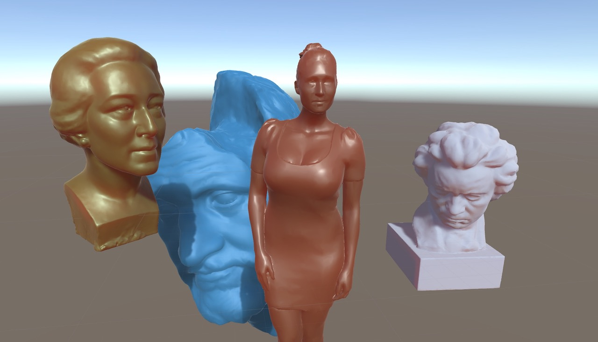
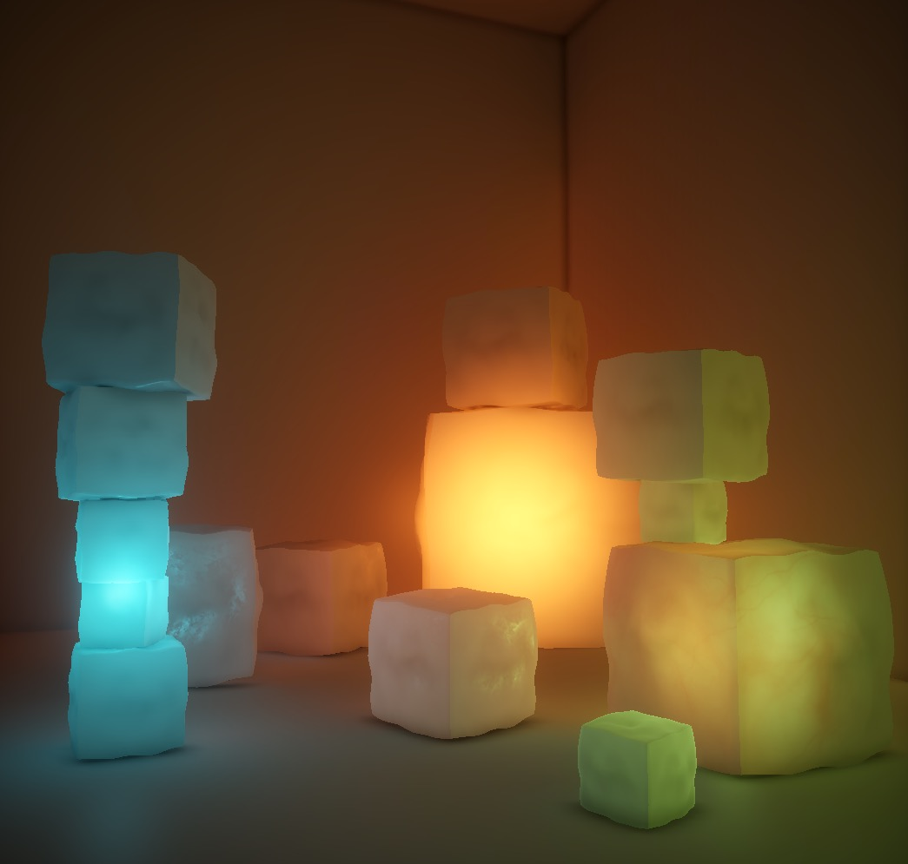
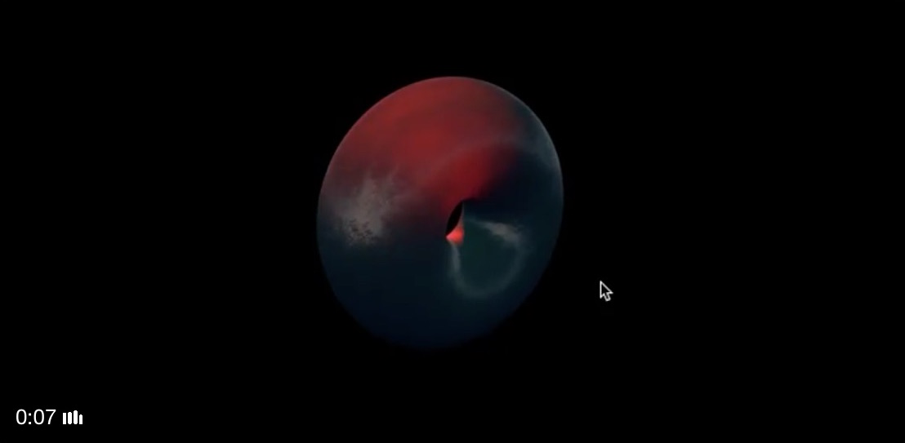

# Subsurface Scattering

[Screen-Space Subsurface Scattering](https://github.com/CustomPhase/CP_SSSSS)

[GDC 2011 – Approximating Translucency for a Fast, Cheap and Convincing Subsurface Scattering Look](https://colinbarrebrisebois.com/2011/03/07/gdc-2011-approximating-translucency-for-a-fast-cheap-and-convincing-subsurface-scattering-look/)

Implemented by Matt DesLauriers in [Tweet](https://twitter.com/mattdesl/status/805784465725419520/video/1) + [Code](https://gist.github.com/mattdesl/2ee82157a86962347dedb6572142df7c)
